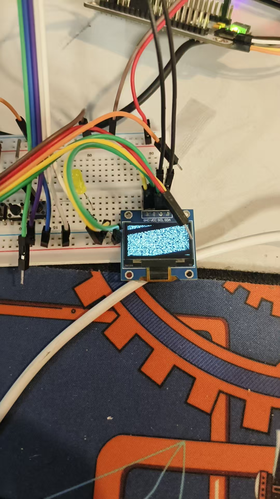
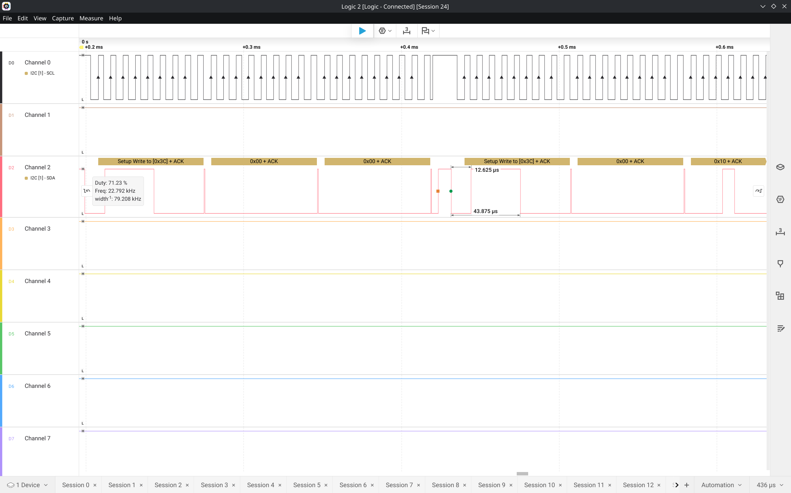

目前看来这个抽象其实还可以

比如尝试初始化 OLED 驱动的代码，原本如此（OLED 显示屏的 ADDR = 60）

```c
OLED_WR_Byte(0xAE,OLED_CMD);//--turn off oled panel
OLED_WR_Byte(0x00,OLED_CMD);//---set low column address
OLED_WR_Byte(0x10,OLED_CMD);//---set high column address
OLED_WR_Byte(0x40,OLED_CMD);//--set start line address  Set Mapping RAM Display Start Line (0x00~0x3F)
OLED_WR_Byte(0x81,OLED_CMD);//--set contrast control register
OLED_WR_Byte(0xCF,OLED_CMD);// Set SEG Output Current Brightness
OLED_WR_Byte(0xA1,OLED_CMD);//--Set SEG/Column Mapping     0xa0左右反置 0xa1正常
OLED_WR_Byte(0xC8,OLED_CMD);//Set COM/Row Scan Direction   0xc0上下反置 0xc8正常
OLED_WR_Byte(0xA6,OLED_CMD);//--set normal display
OLED_WR_Byte(0xA8,OLED_CMD);//--set multiplex ratio(1 to 64)
OLED_WR_Byte(0x3f,OLED_CMD);//--1/64 duty
OLED_WR_Byte(0xD3,OLED_CMD);//-set display offset	Shift Mapping RAM Counter (0x00~0x3F)
OLED_WR_Byte(0x00,OLED_CMD);//-not offset
OLED_WR_Byte(0xd5,OLED_CMD);//--set display clock divide ratio/oscillator frequency
OLED_WR_Byte(0x80,OLED_CMD);//--set divide ratio, Set Clock as 100 Frames/Sec
OLED_WR_Byte(0xD9,OLED_CMD);//--set pre-charge period
OLED_WR_Byte(0xF1,OLED_CMD);//Set Pre-Charge as 15 Clocks & Discharge as 1 Clock
OLED_WR_Byte(0xDA,OLED_CMD);//--set com pins hardware configuration
OLED_WR_Byte(0x12,OLED_CMD);
OLED_WR_Byte(0xDB,OLED_CMD);//--set vcomh
OLED_WR_Byte(0x40,OLED_CMD);//Set VCOM Deselect Level
OLED_WR_Byte(0x20,OLED_CMD);//-Set Page Addressing Mode (0x00/0x01/0x02)
OLED_WR_Byte(0x02,OLED_CMD);//
OLED_WR_Byte(0x8D,OLED_CMD);//--set Charge Pump enable/disable
OLED_WR_Byte(0x14,OLED_CMD);//--set(0x10) disable
OLED_WR_Byte(0xA4,OLED_CMD);// Disable Entire Display On (0xa4/0xa5)
OLED_WR_Byte(0xA6,OLED_CMD);// Disable Inverse Display On (0xa6/a7) 
OLED_Clear();
OLED_WR_Byte(0xAF,OLED_CMD);
```

我没考虑下面两行，所以初始化出来屏幕是花的

```c
OLED_Clear();
OLED_WR_Byte(0xAF,OLED_CMD);
```

`OLED_CMD` 这个指令决定了在写入地址之后需要先写入 0x00 才能发送命令

在我的抽象体系里面，代码如下：

```c
i2c_write(&oled, 60, (uint8_t[]){0x00, 0xAE}, 2);
i2c_write(&oled, 60, (uint8_t[]){0x00, 0x00}, 2);
i2c_write(&oled, 60, (uint8_t[]){0x00, 0x10}, 2);
i2c_write(&oled, 60, (uint8_t[]){0x00, 0x40}, 2);
i2c_write(&oled, 60, (uint8_t[]){0x00, 0x81}, 2);
i2c_write(&oled, 60, (uint8_t[]){0x00, 0xCF}, 2);
i2c_write(&oled, 60, (uint8_t[]){0x00, 0xA1}, 2);
i2c_write(&oled, 60, (uint8_t[]){0x00, 0xC8}, 2);
i2c_write(&oled, 60, (uint8_t[]){0x00, 0xA6}, 2);
i2c_write(&oled, 60, (uint8_t[]){0x00, 0xA8}, 2);
i2c_write(&oled, 60, (uint8_t[]){0x00, 0x3f}, 2);
i2c_write(&oled, 60, (uint8_t[]){0x00, 0xD3}, 2);
i2c_write(&oled, 60, (uint8_t[]){0x00, 0x00}, 2);
i2c_write(&oled, 60, (uint8_t[]){0x00, 0xd5}, 2);
i2c_write(&oled, 60, (uint8_t[]){0x00, 0x80}, 2);
i2c_write(&oled, 60, (uint8_t[]){0x00, 0xD9}, 2);
i2c_write(&oled, 60, (uint8_t[]){0x00, 0xF1}, 2);
i2c_write(&oled, 60, (uint8_t[]){0x00, 0xDA}, 2);
i2c_write(&oled, 60, (uint8_t[]){0x00, 0x12}, 2);
i2c_write(&oled, 60, (uint8_t[]){0x00, 0xDB}, 2);
i2c_write(&oled, 60, (uint8_t[]){0x00, 0x40}, 2);
i2c_write(&oled, 60, (uint8_t[]){0x00, 0x20}, 2);
i2c_write(&oled, 60, (uint8_t[]){0x00, 0x02}, 2);
i2c_write(&oled, 60, (uint8_t[]){0x00, 0x8D}, 2);
i2c_write(&oled, 60, (uint8_t[]){0x00, 0x14}, 2);
i2c_write(&oled, 60, (uint8_t[]){0x00, 0xA4}, 2);
i2c_write(&oled, 60, (uint8_t[]){0x00, 0xA6}, 2);
i2c_write(&oled, 60, (uint8_t[]){0x00, 0xAF}, 2);
```

最后效果自然是从原来的断电黑屏变成正常花屏：





实际上这个是用了底层的 API 弄出来的，封装到上层 OLED 的话可以：

`#define OLED_WRITE_BYTE(byte, mode) i2c_write(&oled, 60, (uint8_t []){ (mode == OLED_CMD) ? 0x00 : 0x40, byte }, 2)`

这个项目用不到 OLED，只作为一个测试用
