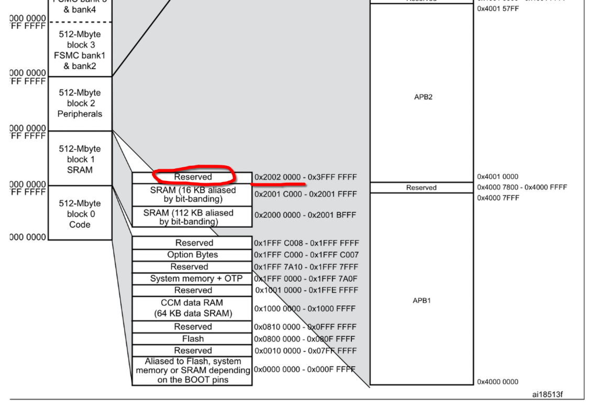

markdown 转微信公众号排版：https://markdown.gmlart.cn/

上篇已经在微信公众号发表，但尚未在个人博客中发表

# [FreeRTOS] 如何在 FreeRTOS 中高效调试栈溢出错误？

## 前言

打完比赛之后感到无事可做，因此最近正在自己 DIY 一个掌上阅读器，为了更好地~~折磨~~提升自己，决定引入一堆自己以前几乎从来没学过的东西，并且还尝试学 Linux 驱动代码的风格去做一个芯片无关的 BSP 层，不过这些不会是这篇文章的重点，等这个项目完工之后应该会整理文档并发博客，不过那都是后话了。

本文将分为上下两篇，上篇你会学到：

1. 如何判断栈溢出、推算栈的占用情况
2. 掌握 FreeRTOS 针对堆栈溢出检测的钩子函数

而在下篇，我们则会聚焦于：

1. Cortex-M4 内核的编程模型与错误处理机制
2. FreeRTOS 的内核初始化与上下文切换逻辑

本文的下篇同时可视为对之前 [STM32 搭建 Zig 开发环境](https://aliferne.github.io/2026/02/17/build-up-zig-dev-env-on-stm32g431/) 理论部分的详细补充。

那么就先介绍下这个问题的背景吧，由于掌上阅读器肯定需要 UI 和 SD 卡，所以我就**引入了 LVGL 和 FatFs**，而因为我雄心相对较大（这不完全只是一个掌上阅读器），所以还**引入了 FreeRTOS**，不过我的水平只局限于能创建一些任务，这个项目也顺带附带着我学习高级用法的想法。

之后我为了测试方便就索性一股脑全写到 ui_task.c 文件中，下面是源代码：

```c
void StartUITask(void const *argument)
{
    lv_init();
    lv_port_disp_init();

    /* 文件操作部分 ------------------------- */
    FIL fp;
    /* 本质是 f_open */
    FRESULT res = storage_open(&sdcard, &fp, "test.txt", FA_READ | FA_OPEN_EXISTING);
    UINT fnum   = 0;
    ASSERT_FAIL(res != FR_OK,
                /* 本质是 f_close */
                storage_close(&fp);
                /* 本质是 vTaskDelay(1000); */
                for (;;) { os_delay_ms(1000); });
    /* 本质是 f_read */
    res = storage_read(&fp, buf, LEN(buf), &fnum);
    ASSERT_FAIL(res != FR_OK,
                storage_close(&fp);
                for (;;) { os_delay_ms(1000); });
    storage_close(&fp);
    /* 文件操作部分 End ------------------------- */

    /* UI 部分 ------------------------- */
    static lv_style_t style;
    lv_style_init(&style);
    lv_style_set_radius(&style, 5);

    /*Make a gradient*/
    lv_style_set_width(&style, 128);
    lv_style_set_height(&style, LV_SIZE_CONTENT);

    lv_style_set_pad_ver(&style, 0);
    lv_style_set_pad_left(&style, 0);

    lv_style_set_x(&style, lv_pct(0));
    lv_style_set_y(&style, 0);

    /*Create an object with the new style*/
    lv_obj_t *obj = lv_obj_create(lv_scr_act());
    lv_obj_add_style(obj, &style, 0);

    lv_obj_t *label = lv_label_create(obj);

    if (buf[0] != 0)
        lv_label_set_text(label, buf);
    else
        lv_label_set_text(label, "确认");
    /* UI 部分 End ------------------------- */

    for (;;) {
        /* 以约 500ms 的周期闪烁 LED */
        gpio_toggle(&usr_led);

        lv_timer_handler();
        os_delay_ms(500);
    }
}
```

其中 `ASSERT_FAIL` 是一个自己写的很简单的宏：

```c
/* 失败断言宏，断言 cond 一定为假，否则执行 actions 操作 */
#define ASSERT_FAIL(cond, actions) \
    do {                           \
        if ((cond)) {              \
            actions;               \
        }                          \
    } while (0)
```

而任务创建函数则为：

```c
osThreadDef(UITask, StartUITask, osPriorityNormal, 0, 512);
UITaskHandle = osThreadCreate(osThread(UITask), NULL);
```

相信一看代码，老手基本就知道是什么情况了，**确实就是栈分配得不够**，不过还是想请你们看我的一整套 Debug 流程，做一个抛砖引玉的作用，希望能够得到高人的指导，比如更快定位问题的方法，一些 Debug 的方法论等等，在此谢谢大家了。

## 事故现场复现

本次事故的表现是 LED 灯不闪烁，而屏幕可以正常显示。

这个名为 test.txt 的文件是存在的，因此不存在卡死在一开始的 `for` 循环的情况，而读取操作完全正常， 而 UI 界面可以显示文件内容，这就使我犯了难，至少表面上看起来不像是代码问题，不过还是得看下代码的。

由于其他任务均为空实现，我因此最先怀疑的就是 ui_task 的代码问题，上面代码很明显可以分为两部分操作，一部分是文件 IO，另一部分是 UI 绘制，我在源代码上均做了标注，我的测试有三个步骤：

1. 注释 *文件 IO* 和 *UI 绘制*, 烧录发现 LED 正常闪烁，进入 debug 发现上下文正常切换
2. 注释 *文件 IO*, 烧录发现 LED 无法闪烁，进入 debug 发现触发 HardFault
3. 注释 *UI 绘制*, 现象同第一次尝试

到这里基本可以确定肯定是 LVGL 啥的有点问题，不过不可能怀疑到人家源代码上，~~毕竟人家水平比我高多了~~所以没办法，也只能进 Debug 看堆栈了。

我的断点设置在两句 `ASSERT_FAIL` 处，以及最后 `for` 循环的三个函数内。逐步执行，两句宏的断言均通过，而最后在 `os_delay_ms(500)` 处，按步执行之后不再正常进入此任务，而正常来说应当会从 `gpio_toggle` 再度执行循环内函数。

我们继续 debug，按下暂停，发现进了 `HardFault_Handler`，而 HardFault 一般都会跟内存访问，或者写了一些不该写的东西之类的有关，根据上面的测试情况，我们很容易想到注释一些东西之后执行的内容会变少，也就是栈空间占用变少，那么我们就来计算一下栈空间的使用情况吧。

## 计算堆栈调用情况

我们先来看这个 `FIL`，它是个结构体：

```c
typedef struct {
	FFOBJID	obj;		/* Object identifier (must be the 1st member to detect invalid object pointer) */
	BYTE	flag;		/* File status flags */
	BYTE	err;		/* Abort flag (error code) */
	FSIZE_t	fptr;		/* File read/write pointer (0 on open) */
	DWORD	clust;		/* Current cluster of fptr (invalid when fptr is 0) */
	LBA_t	sect;		/* Sector number appearing in buf[] (0:invalid) */
#if !FF_FS_READONLY
	LBA_t	dir_sect;	/* Sector number containing the directory entry (not used in exFAT) */
	BYTE*	dir_ptr;	/* Pointer to the directory entry in the win[] (not used in exFAT) */
#endif
#if FF_USE_FASTSEEK
	DWORD*	cltbl;		/* Pointer to the cluster link map table (nulled on open; set by application) */
#endif
#if !FF_FS_TINY
	BYTE	buf[FF_MAX_SS];	/* File private data read/write window */
#endif
} FIL;
```

由于这里面的宏全都是满足条件的，即所有的变量都被启用了，我们需要全部计算：

首先是第一部分：
`BYTE + BYTE + DWORD + BYTE* + DWORD* + BYTE * FF_MAX_SS`

32 位单片机的地址是 32 位的，所以是四个字节，那么对于第一部分就有：
1 + 1 + 4 + 4 + 4 + 1 * 512 = 526

然后第二部分：
`FFOBJID + FSIZE_t + LBA_t + LBA_t`

其中 `FFOBJID = FATFS* + WORD + BYTE + BYTE + DWORD + FSIZE_t + DWORD * 5` (我没启用 `FF_FS_LOCK` 宏)

那么就是：
(4 + 2 + 1 + 1 + 4 + 8 + 4 * 5) + 8 + 4 + 4 = 56

两部分合起来为 582 Bytes，这是理论值，我们没考虑结构体对齐的问题，实际会更大些。
如果你使用 Vscode + Clangd 插件的话，借助 `sizeof` 然后鼠标悬浮一下就可以看到值的大小，我这里显示为 600 Bytes.

更加准确的做法是：

```bash
arm-none-eabi-objdump -d ./build/Self-DIY-Kindle/Self-DIY-Kindel.elf --disassemble=StartUITask
```

然后找到这一行：

```asm
0803067c <StartUITask>:
 803067c:	b530      	push	{r4, r5, lr}
 803067e:	f5ad 7d19 	sub.w	sp, sp, #612	@ 0x264
```

这里的 612 是实际占用堆栈的大小，注意汇编码为 `sub.w`，这表示它的单位是 Word。而 STM32CubeMX 分配这个是明确标注为 Words 的，而我们上面分配了 512 Words，换句话说我们通过反汇编看出来堆栈已经超了。

剩下的是函数调用，实际上不好估算，根据函数调用堆栈的模型，我们需要找到调用链最深的，局部变量最多的，那个被调用的函数占用的栈帧空间 + 自身占用的栈帧空间就是整个栈会使用到的最大值，由于我们已经通过反汇编看出来了，所以就不估算了。

## 解决方法

很简单，只要把 `FIL` 变成全局变量，让它到 bss 段去占整个 Flash 的空间，别挤在栈里基本就差不多了，如果还不放心则可以给任务分配大点栈空间。

## 简易方法实现栈溢出检测

上面那一套算来算去还要看反汇编的太麻烦了，并且我还发现如果没有 `FIL` 这个变量，连 `sub.w sp` 这个操作都不会有，就会更难看出栈大小，而我闲着无聊翻 FreeRTOS 的文档的时候偶然发现一个[简便的方法][FreeRTOS 堆栈使用和堆栈溢出检查].

简单总结一下就是人家提供了 `configCHECK_FOR_STACK_OVERFLOW` 宏的配置（CubeMX 有这个配置选项，不过默认是 Disable，所以我看 config 文件的时候一直以为没有对应的调试方法，还是得多看文档啊），通过定义为不同的数值来对应设置如何检查堆栈溢出情况，并通过如下钩子函数：

```c
void vApplicationStackOverflowHook( TaskHandle_t xTask,
                                    char *pcTaskName );
```

来执行你自定义的调试信息。

我给这个宏设置为了 1, 则对应应该是这段代码被启用：

```c
#if( ( configCHECK_FOR_STACK_OVERFLOW == 1 ) && ( portSTACK_GROWTH < 0 ) )

	/* Only the current stack state is to be checked. */
	#define taskCHECK_FOR_STACK_OVERFLOW()																\
	{																									\
		/* Is the currently saved stack pointer within the stack limit? */								\
		if( pxCurrentTCB->pxTopOfStack <= pxCurrentTCB->pxStack )										\
		{																								\
			vApplicationStackOverflowHook( ( TaskHandle_t ) pxCurrentTCB, pxCurrentTCB->pcTaskName );	\
		}																								\
	}

#endif /* configCHECK_FOR_STACK_OVERFLOW == 1 */
```

然后自定义逻辑则为：

```c
void vApplicationStackOverflowHook(TaskHandle_t xTask,
                                   char *pcTaskName)
{
    printf("Stack Overflow! %s\n", pcTaskName);
    if (strcmp(pcTaskName, "UITask") == 0) {
        gpio_write(&usr_led, GPIO_Level_High);
    }
}
```

串口便确实能打印出这个信息，而 LED 也如预想中亮起了（缺省行为是熄灭的）。

# [FreeRTOS] FreeRTOS 的上下文切换与栈溢出 —— 从 PendSV 到 HardFault 的调试全流程

让我们书接上回。

## 深挖栈溢出异常

我们回到刚看到 `HardFault` 的时候，此时我们来观察调用堆栈：

```
HardFault_Handler@0x080009e2 (/home/ferne/code/self-proj/Self-DIY-Kindle/Core/Src/stm32f4xx_it.c:95)
<signal handler called>@0xfffffff1 (未知源:0)
PendSV_Handler@0x080075a0 (/home/ferne/code/self-proj/Self-DIY-Kindle/Middlewares/Third_Party/FreeRTOS/Source/portable/GCC/ARM_CM4F/port.c:435)
```

得，一个 PendSV，一个 HardFault，还有个不知道什么情况的 signal handler 返回码，准备翻手册吧。
由于有 [上一篇文章](https://aliferne.github.io/2026/02/17/build-up-zig-dev-env-on-stm32g431/) 的经验，查手册还是非常轻车熟路的。

首先看 0xE000ED2C，先确认一下 HFSR 是个什么情况，看到值又是 0x40000000，依然非常熟悉的 FORCED 置位，说明真凶另有他人，接下来让我们看到 CFSR(0xE000ED28)，发现值为 0x00008200，将该值与 (1 << 9) 到 (1 << 15) 做与运算，发现分别为 bit 9 和 bit 15 被置位，对应为 PRECIS ERR 和 BFARVALID.

由于 BFARVALID = 1，我们还需要看一下 BFAR 的值是什么，查阅 Cortex M4 手册可以得知寄存器值为 0x20020000，也就是说 PC 访问了这个地址，然后触发了 PRECIS ERR 之后立马跳到 HardFault

最后是 signal handler 返回的是 0xFFFFFFF1 （顺带说一句，正常情况下应当为 0xFFFFFFFD，我们会在下文进行详细的讲解），对应 `EXC_RETURN` 的值为这个。

### F407 内存布局

每次和内核有关的错误基本应该都要先查下内存问题了，看下是不是越界访问啥的，或者是栈错误等各种神奇但又比较常见的原因。

直接去立创商城搜 F407VET6 就能找到数据手册，然后找到内存映射相关的章节，发现如图所示：



问题很明显，肯定是内存越界访问了，但这和之前提到的栈有什么关系？

## Cortex-M4 编程模型及异常处理机制讲解

在此之前我们需要先简单了解一下 Cortex-M4 的内核设计和错误机制处理，这有助于我们展开接下来内容的讲解。

以下内容均选自《Arm Cortex-M3 与 Cortex-M4 权威指南》，下称《权威指南》。

### 编程模型

M4 内核的编程模型是 “二二二” 模型：
- 两种操作状态：调试状态；Thumb 状态
- 两种模式：处理模式(Handler)；线程模式(Thread)
- 两种权限：特权级；非特权级（下称用户级）


这篇文章中我们重点关注模式和权限：

线程模式是处理器正常执行代码时对应的模式，而处理模式是处理器进入异常/中断时的处理模式；处理器一般默认在特权级状态运行，但是当有 RTOS 时，执行任务则一般以用户级模式运行程序。

软件可以把自身从特权级切换到用户级，但是要想切回来就必须借助异常机制。

通过区分特权级和用户级，我们实际上可以实现对一些关键资源的保护，以及提供一个基本的安全模型。

### 异常处理机制

#### 什么是异常

《权威指南》中对于异常的定义为：改变程序流的事件。当异常发生时，处理器会暂停当前任务，并转而去执行一段被称为异常处理的程序，在执行完毕之后回到之前的任务。

其实从上面的叙述中，你已经可以把异常和中断画个约等号了（中断实际上就是异常的一种），我们在初学中断的时候也是这么一个定义方法，不过这段程序被称为中断服务程序(ISR).

然而，我们常见~~且可恨~~的 `HardFault` 实际上不是中断，而是系统异常（《权威指南》 Chapter 4.5.1, P74）。而对应的 `Handler` 里面的程序是异常处理程序，而非 ISR。

对于 Cortex-M3/4 内核来说，有几个异常为错误处理异常，处理器检测到错误时则会触发这些异常，比如 `HardFault`, `UsageFault`, `MemManageFault`, `BusFault`，然而我们总是见到 `HardFault` 的死循环，而不是其他的，这是为什么呢？实际上内核的缺省行为是只使能了 `HardFault`，从而其他所有的错误处理异常都会被重定向到 `HardFault` 中，而在内核中 `HardFault` 有一块专门的寄存器 `SCB->HFSR`，这个寄存器的第 31 位 (`FORCED`) 会告诉你 `HardFault` 是不是由其他错误重定向而来。基本上 75% 以上的情况，我们都能认为 `HardFault` 是被重定向而来的(其自身发生的概率仅为 25%，如果只算理论值的话)。

### 异常处理流程

TODO:

## OS、影子栈、SVC 与 PendSV

### 什么是 OS，什么是 RTOS

这部分是我个人的拙见，如有错误还请多多海涵，不吝赐教。

OS，按照教科书上的定义，指的是管理计算机硬件与软件资源的程序。打个比方，就好比你去餐厅吃饭，跟服务员点菜，服务员负责把订单交给厨师，此外服务员同时负责维持餐厅的秩序，这里服务员就承担着类似于 OS 的角色，服务员既要和厨师（底层硬件）交流，又要负责安排客人入座，维持现场秩序（管理各种资源）。

而 RTOS 则相对而言更加简化一些，它依然需要管理各种资源，也依然需要和底层硬件沟通，但是 RTOS 则更加侧重于 RT (Real-Time)，就好比一个火爆的大餐厅，服务员不一定顾得上你，而一个苍蝇馆子，服务员则更能快速给你上菜。

广义上来说，一个 OS 可以分为三个组成部分：内核、 Shell，和一些杂七杂八的软件。但对于一个 OS 来说，**最核心的概念实际上是内核**，也就是**负责线程/进程/任务管理、内存管理、驱动管理等的程序**。这也是为什么 Linux 有那么多发行版，但它们仍然是 Linux； 各种 RTOS 虽然复杂程度不一（FreeRTOS 只有非常轻量的内核，RTT 和 Zephyr 可以有宛如 Linux 般的 dts 等复杂驱动适配），但它们都提供了任务创建、调度、信号量、各种锁，因为 OS 的核心与灵魂就是内核，而 RTOS 则是任务调度.

因此理解 RTOS 的内核在干些什么，就理解了 RTOS 在干什么。不过我们在这里不会讲调度算法，而是会更加侧重于 OS 的启动流程和上下文切换逻辑。我们将在下面介绍 Cortex-M 内核用于支持嵌入式 OS 的两个异常，并由此引出启动流程和上下文切换的逻辑。

### 什么是影子栈

实际上 Cortex-M 内核为了支持 RTOS，特地设置了两套栈指针：

- 主栈指针 MSP
- 进程栈指针 PSP

之所以叫影子栈，我想是因为对于一般程序来说，在同一时刻不能同时见到两个栈指针，从而也就实现了一个栈为另一个栈的“影子”，看不见也摸不着（《权威指南》并没有说为什么叫影子栈，但提到了同一时刻无法同时看到两个栈）。

在不使用 RTOS 的情况下，程序只需要主栈指针即可，但是在使用 RTOS 的情况下，则需要进程栈指针，分开设置两套栈指针的目的，实际上是为了安全和高效：

- 在有 RTOS 时，内核使用主栈，而任务使用进程栈，这样在某个任务的任务栈溢出之后，内核和其他任务的栈不会受到影响（栈空间的分配不是连续的，因此不太可能覆写其他栈）。
- 每个任务只需要满足自身栈的最大需求和从上下文切换中保存的上一级栈的栈帧，以及一些特定的条件即可，不需要考虑 ISR 和嵌套中断的栈，这就使得静态分配栈空间成为可能。
- OS 还能借助存储器保护单元（MPU）还能访问某个栈区的任务，同时在它有栈溢出风险时，MPU 可以触发 `MemManageFault` 并避免栈空间以外的存储区域被覆盖。

### 什么是 SVC

SVC 又叫做请求管理调用，

### 什么是 PendSV

### FreeRTOS 内的 PendSV_Handler 实现

```c
void xPortPendSVHandler( void )
{
	/* This is a naked function. */

	__asm volatile
	(
	"	mrs r0, psp							\n"
	"	isb									\n"
	"										\n"
	"	ldr	r3, pxCurrentTCBConst			\n" /* Get the location of the current TCB. */
	"	ldr	r2, [r3]						\n"
	"										\n"
	"	tst r14, #0x10						\n" /* Is the task using the FPU context?  If so, push high vfp registers. */
	"	it eq								\n"
	"	vstmdbeq r0!, {s16-s31}				\n"
	"										\n"
	"	stmdb r0!, {r4-r11, r14}			\n" /* Save the core registers. */
	"	str r0, [r2]						\n" /* Save the new top of stack into the first member of the TCB. */
	"										\n"
	"	stmdb sp!, {r0, r3}					\n"
	"	mov r0, %0 							\n"
	"	msr basepri, r0						\n"
	"	dsb									\n"
	"	isb									\n"
	"	bl vTaskSwitchContext				\n"
	"	mov r0, #0							\n"
	"	msr basepri, r0						\n"
	"	ldmia sp!, {r0, r3}					\n"
	"										\n"
	"	ldr r1, [r3]						\n" /* The first item in pxCurrentTCB is the task top of stack. */
	"	ldr r0, [r1]						\n"
	"										\n"
	"	ldmia r0!, {r4-r11, r14}			\n" /* Pop the core registers. */
	"										\n"
	"	tst r14, #0x10						\n" /* Is the task using the FPU context?  If so, pop the high vfp registers too. */
	"	it eq								\n"
	"	vldmiaeq r0!, {s16-s31}				\n"
	"										\n"
	"	msr psp, r0							\n"
	"	isb									\n"
	"										\n"
	#ifdef WORKAROUND_PMU_CM001 /* XMC4000 specific errata workaround. */
		#if WORKAROUND_PMU_CM001 == 1
	"			push { r14 }				\n"
	"			pop { pc }					\n"
		#endif
	#endif
	"										\n"
	"	bx r14								\n"
	"										\n"
	"	.align 4							\n"
	"pxCurrentTCBConst: .word pxCurrentTCB	\n"
	::"i"(configMAX_SYSCALL_INTERRUPT_PRIORITY)
	);
}
```

## 总结

这次其实确确实实暴露了我对 FreeRTOS 了解不深的严重问题，也正好和我的初心相符了，算是一种求锤得锤吧（笑）。**如果遇到了什么玄学问题，首先看下堆栈啥的正不正常，这也许是各种 RTOS 在调试时先要确认的一步吧**！此外还因为这个 BUG 而被迫看了 FreeRTOS 的代码，说实话写得还真的非常漂亮，仿佛在欣赏一件艺术品，已严肃偷师（笑）。

---

[STM32 Cortex M4 编程手册]: https://www.st.com/content/ccc/resource/technical/document/programming_manual/6c/3a/cb/e7/e4/ea/44/9b/DM00046982.pdf/files/DM00046982.pdf/jcr:content/translations/en.DM00046982.pdf
[ARM CM3/4 异常进入与返回的过程]: https://shequ.stmicroelectronics.cn/thread-604515-1-1.html
[RTOS 基础知识]: https://wwww.freertos.org/zh-cn-cmn-s/Documentation/01-FreeRTOS-quick-start/01-Beginners-guide/01-RTOS-fundamentals
[深入理解操作系统的概念及定位]: https://www.cnblogs.com/kevinbee/p/18678187
[FreeRTOS 堆栈使用和堆栈溢出检查]: https://w.freertos.org/zh-cn-cmn-s/Documentation/02-Kernel/02-Kernel-features/09-Memory-management/02-Stack-usage-and-stack-overflow-checking
[RTOS Ref]: https://www.zhihu.com/question/593816921/answer/1957909257069520682?share_code=14IBMqKlAx7yM&utm_psn=2050173737027236484
