markdown 转微信公众号排版：https://markdown.gmlart.cn/

上篇已经在微信公众号发表，但尚未在个人博客中发表

# [FreeRTOS] 如何在 FreeRTOS 中高效调试栈溢出错误？

## 前言

打完比赛之后感到无事可做，因此最近正在自己 DIY 一个掌上阅读器，为了更好地~~折磨~~提升自己，决定引入一堆自己以前几乎从来没学过的东西，并且还尝试学 Linux 驱动代码的风格去做一个芯片无关的 BSP 层，不过这些不会是这篇文章的重点，等这个项目完工之后应该会整理文档并发博客，不过那都是后话了。

本文将分为上下两篇，上篇你会学到：

1. 如何判断栈溢出、推算栈的占用情况
2. 掌握 FreeRTOS 针对堆栈溢出检测的钩子函数

而在下篇，我们则会聚焦于：

1. Cortex-M4 内核的编程模型与错误处理机制
2. FreeRTOS 的内核初始化与上下文切换逻辑

本文的下篇同时可视为对之前 [STM32 搭建 Zig 开发环境](https://aliferne.github.io/2026/02/17/build-up-zig-dev-env-on-stm32g431/) 理论部分的详细补充。

## 事故代码

那么就先介绍下这个问题的背景吧，由于掌上阅读器肯定需要 UI 和 SD 卡，所以我就**引入了 LVGL 和 FatFs**，而因为我雄心相对较大（这不完全只是一个掌上阅读器），所以还**引入了 FreeRTOS**，不过我的水平只局限于能创建一些任务，这个项目也顺带附带着我学习高级用法的想法。

之后我为了测试方便就索性一股脑全写到 ui_task.c 文件中，下面是源代码：

```c
void StartUITask(void const *argument)
{
    lv_init();
    lv_port_disp_init();

    /* 文件操作部分 ------------------------- */
    FIL fp;
    /* 本质是 f_open */
    FRESULT res = storage_open(&sdcard, &fp, "test.txt", FA_READ | FA_OPEN_EXISTING);
    UINT fnum   = 0;
    ASSERT_FAIL(res != FR_OK,
                /* 本质是 f_close */
                storage_close(&fp);
                /* 本质是 vTaskDelay(1000); */
                for (;;) { os_delay_ms(1000); });
    /* 本质是 f_read */
    res = storage_read(&fp, buf, LEN(buf), &fnum);
    ASSERT_FAIL(res != FR_OK,
                storage_close(&fp);
                for (;;) { os_delay_ms(1000); });
    storage_close(&fp);
    /* 文件操作部分 End ------------------------- */

    /* UI 部分 ------------------------- */
    static lv_style_t style;
    lv_style_init(&style);
    lv_style_set_radius(&style, 5);

    /*Make a gradient*/
    lv_style_set_width(&style, 128);
    lv_style_set_height(&style, LV_SIZE_CONTENT);

    lv_style_set_pad_ver(&style, 0);
    lv_style_set_pad_left(&style, 0);

    lv_style_set_x(&style, lv_pct(0));
    lv_style_set_y(&style, 0);

    /*Create an object with the new style*/
    lv_obj_t *obj = lv_obj_create(lv_scr_act());
    lv_obj_add_style(obj, &style, 0);

    lv_obj_t *label = lv_label_create(obj);

    if (buf[0] != 0)
        lv_label_set_text(label, buf);
    else
        lv_label_set_text(label, "确认");
    /* UI 部分 End ------------------------- */

    for (;;) {
        /* 以约 500ms 的周期闪烁 LED */
        gpio_toggle(&usr_led);

        lv_timer_handler();
        os_delay_ms(500);
    }
}
```

其中 `ASSERT_FAIL` 是一个自己写的很简单的宏：

```c
/* 失败断言宏，断言 cond 一定为假，否则执行 actions 操作 */
#define ASSERT_FAIL(cond, actions) \
    do {                           \
        if ((cond)) {              \
            actions;               \
        }                          \
    } while (0)
```

而任务创建函数则为：

```c
osThreadDef(UITask, StartUITask, osPriorityNormal, 0, 512);
UITaskHandle = osThreadCreate(osThread(UITask), NULL);
```

相信一看代码，老手基本就知道是什么情况了，**确实就是栈分配得不够**，不过还是想请你们看我的一整套 Debug 流程，做一个抛砖引玉的作用，希望能够得到高人的指导，比如更快定位问题的方法，一些 Debug 的方法论等等，在此谢谢大家了。

## 事故现场复现

本次事故的表现是 LED 灯不闪烁，而屏幕可以正常显示。

这个名为 test.txt 的文件是存在的，因此不存在卡死在一开始的 `for` 循环的情况，而读取操作完全正常， 而 UI 界面可以显示文件内容，这就使我犯了难，至少表面上看起来不像是代码问题，不过还是得看下代码的。

由于其他任务均为空实现，我因此最先怀疑的就是 ui_task 的代码问题，上面代码很明显可以分为两部分操作，一部分是文件 IO，另一部分是 UI 绘制，我在源代码上均做了标注，我的测试有三个步骤：

1. 注释 *文件 IO* 和 *UI 绘制*, 烧录发现 LED 正常闪烁，进入 debug 发现上下文正常切换
2. 注释 *文件 IO*, 烧录发现 LED 无法闪烁，进入 debug 发现触发 HardFault
3. 注释 *UI 绘制*, 现象同第一次尝试

到这里基本可以确定肯定是 LVGL 啥的有点问题，不过不可能怀疑到人家源代码上，~~毕竟人家水平比我高多了~~所以没办法，也只能进 Debug 看堆栈了。

我的断点设置在两句 `ASSERT_FAIL` 处，以及最后 `for` 循环的三个函数内。逐步执行，两句宏的断言均通过，而最后在 `os_delay_ms(500)` 处，按步执行之后不再正常进入此任务，而正常来说应当会从 `gpio_toggle` 再度执行循环内函数。

我们继续 debug，按下暂停，发现进了 `HardFault_Handler`，而 HardFault 一般都会跟内存访问，或者写了一些不该写的东西之类的有关，根据上面的测试情况，我们很容易想到注释一些东西之后执行的内容会变少，也就是栈空间占用变少，那么我们就来计算一下栈空间的使用情况吧。

## 计算堆栈调用情况

我们先来看这个 `FIL`，它是个结构体：

```c
typedef struct {
	FFOBJID	obj;		/* Object identifier (must be the 1st member to detect invalid object pointer) */
	BYTE	flag;		/* File status flags */
	BYTE	err;		/* Abort flag (error code) */
	FSIZE_t	fptr;		/* File read/write pointer (0 on open) */
	DWORD	clust;		/* Current cluster of fptr (invalid when fptr is 0) */
	LBA_t	sect;		/* Sector number appearing in buf[] (0:invalid) */
#if !FF_FS_READONLY
	LBA_t	dir_sect;	/* Sector number containing the directory entry (not used in exFAT) */
	BYTE*	dir_ptr;	/* Pointer to the directory entry in the win[] (not used in exFAT) */
#endif
#if FF_USE_FASTSEEK
	DWORD*	cltbl;		/* Pointer to the cluster link map table (nulled on open; set by application) */
#endif
#if !FF_FS_TINY
	BYTE	buf[FF_MAX_SS];	/* File private data read/write window */
#endif
} FIL;
```

由于这里面的宏全都是满足条件的，即所有的变量都被启用了，我们需要全部计算：

首先是第一部分：
`BYTE + BYTE + DWORD + BYTE* + DWORD* + BYTE * FF_MAX_SS`

32 位单片机的地址是 32 位的，所以是四个字节，那么对于第一部分就有：
1 + 1 + 4 + 4 + 4 + 1 * 512 = 526

然后第二部分：
`FFOBJID + FSIZE_t + LBA_t + LBA_t`

其中 `FFOBJID = FATFS* + WORD + BYTE + BYTE + DWORD + FSIZE_t + DWORD * 5` (我没启用 `FF_FS_LOCK` 宏)

那么就是：
(4 + 2 + 1 + 1 + 4 + 8 + 4 * 5) + 8 + 4 + 4 = 56

两部分合起来为 582 Bytes，这是理论值，我们没考虑结构体对齐的问题，实际会更大些。
如果你使用 Vscode + Clangd 插件的话，借助 `sizeof` 然后鼠标悬浮一下就可以看到值的大小，我这里显示为 600 Bytes.

更加准确的做法是：

```bash
arm-none-eabi-objdump -d ./build/Self-DIY-Kindle/Self-DIY-Kindel.elf --disassemble=StartUITask
```

然后找到这一行：

```asm
0803067c <StartUITask>:
 803067c:	b530      	push	{r4, r5, lr}
 803067e:	f5ad 7d19 	sub.w	sp, sp, #612	@ 0x264
```

这里的 612 是实际占用堆栈的大小，汇编码为 `sub.w` 表示其是宽字节（32位的）。
这里分配了 612 Bytes

剩下的是函数调用，实际上不好估算，根据函数调用堆栈的模型，我们**需要找到调用链最深的**，因为这个估算起来太麻烦了我们就不找了。

## 解决方法

很简单，因为本质是栈溢出，那么只要把 `FIL` 变成全局变量，让它到 bss 段去占整个 Flash 的空间，别挤在栈里基本就差不多了，如果还不放心则可以给任务分配大点栈空间。

## 简易方法实现栈溢出检测

上面那一套算来算去还要看反汇编的太麻烦了，并且我还发现如果没有 `FIL` 这个变量，连 `sub.w sp` 这个操作都不会有，就会更难看出栈大小，而我闲着无聊翻 FreeRTOS 的文档的时候偶然发现一个[简便的方法][FreeRTOS 堆栈使用和堆栈溢出检查].

简单总结一下就是人家提供了 `configCHECK_FOR_STACK_OVERFLOW` 宏的配置（CubeMX 有这个配置选项，不过默认是 Disable，所以我看 config 文件的时候一直以为没有对应的调试方法，还是得多看文档啊），通过定义为不同的数值来对应设置如何检查堆栈溢出情况，并通过如下钩子函数：

```c
void vApplicationStackOverflowHook( TaskHandle_t xTask,
                                    char *pcTaskName );
```

来执行你自定义的调试信息。

我给这个宏设置为了 1, 则对应应该是这段代码被启用：

```c
#if( ( configCHECK_FOR_STACK_OVERFLOW == 1 ) && ( portSTACK_GROWTH < 0 ) )

	/* Only the current stack state is to be checked. */
	#define taskCHECK_FOR_STACK_OVERFLOW()																\
	{																									\
		/* Is the currently saved stack pointer within the stack limit? */								\
		if( pxCurrentTCB->pxTopOfStack <= pxCurrentTCB->pxStack )										\
		{																								\
			vApplicationStackOverflowHook( ( TaskHandle_t ) pxCurrentTCB, pxCurrentTCB->pcTaskName );	\
		}																								\
	}

#endif /* configCHECK_FOR_STACK_OVERFLOW == 1 */
```

然后自定义逻辑则为：

```c
void vApplicationStackOverflowHook(TaskHandle_t xTask,
                                   char *pcTaskName)
{
    printf("Stack Overflow! %s\n", pcTaskName);
    if (strcmp(pcTaskName, "UITask") == 0) {
        gpio_write(&usr_led, GPIO_Level_High);
    }
}
```

串口便确实能打印出这个信息，而 LED 也如预想中亮起了（缺省行为是熄灭的）。

不过这并没有结束，我们目前只知道是栈溢出，对于只想在用 FreeRTOS 时定位有无栈溢出的读者来说，这一篇基本上够你用了，但是我不想止步于此，因此我还会定位栈溢出究竟导致了什么，才会使得 MCU 触发了 HardFault. 非常不幸的是，想要搞清楚这方面的问题，你几乎必然需要了解内核，因此我们在第二篇将会花费大量精力去讲解 Cortex-M4 内核的一些设计，这势必会劝退很多读者，不过如果你对这类话题感兴趣的话，那么欢迎来观看我的下一篇博客！

# [FreeRTOS] FreeRTOS 的上下文切换与栈溢出 —— 从 PendSV 到 HardFault 的调试全流程

[需要填写上篇的链接] 让我们书接上回。

## 深挖栈溢出异常

我们回到刚看到 `HardFault` 的时候，此时我们来观察调用堆栈：

```
HardFault_Handler@0x080009ec (/home/ferne/code/self-proj/Self-DIY-Kindle/Core/Src/stm32f4xx_it.c:95)
<signal handler called>@0xfffffff1 (未知源:0)
PendSV_Handler@0x0800774e (/home/ferne/code/self-proj/Self-DIY-Kindle/Middlewares/Third_Party/FreeRTOS/Source/portable/GCC/ARM_CM4F/port.c:443)
```

得，一个 PendSV，一个 HardFault，还有个不知道什么情况的 signal handler 返回码，准备翻手册吧。
由于有 [搭建 Zig 开发环境那篇文章](https://aliferne.github.io/2026/02/17/build-up-zig-dev-env-on-stm32g431/) 的经验，查手册还是非常轻车熟路的。

首先看 0xE000ED2C，先确认一下 HFSR 是个什么情况，看到值又是 0x40000000，依然非常熟悉的 FORCED 置位，说明真凶另有他人，接下来让我们看到 CFSR(0xE000ED28)，
发现值为 0x0100 0000，查阅内核手册即可得知对应 Bit 24 被置位（即 UNALIGNED 标志位），这说明以未对齐的方式访问了内存。

最后是 signal handler 返回的是 0xFFFFFFF1 （顺带说一句，正常情况下应当为 0xFFFFFFFD，我们会在下文进行详细的讲解），对应 `EXC_RETURN` 的值为这个，我们会在下面讲解 `EXC_RETURN`，把之前搭建 Zig 环境的坑填上。

## Cortex-M4 编程模型，栈设计及异常处理机制

在此之前我们需要先简单了解一下 Cortex-M4 的内核设计和错误机制处理，这有助于我们展开接下来内容的讲解。

以下内容均选自《Arm Cortex-M3 与 Cortex-M4 权威指南》，下称《权威指南》，需要注意的是部分整合了个人的理解，因此下面的内容只能当作二道贩子兜售的二手知识，想要有更详细的理解，还是需要看原著，并且自己亲手调一遍 HardFault，这些知识才会是你的。

### 编程模型

M4 内核的编程模型是 “二二二” 模型：
- 两种操作状态：调试状态；Thumb 状态
- 两种模式：处理模式(Handler)；线程模式(Thread)
- 两种权限：特权级；非特权级（下称用户级）

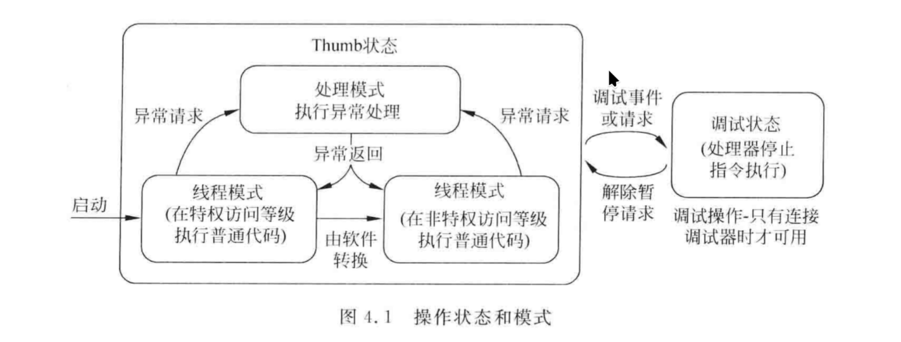

这篇文章中我们重点关注模式和权限：

线程模式是处理器正常执行代码时对应的模式，而处理模式是处理器进入异常/中断时的处理模式；处理器一般默认在特权级状态运行，但是当有 RTOS 时，执行任务则一般以用户级模式运行程序。

软件可以把自身从特权级切换到用户级，但是要想切回来就必须借助异常机制。

通过区分特权级和用户级，我们实际上可以实现对一些关键资源的保护，以及提供一个基本的安全模型。

### 栈设计与影子栈

我们都知道，程序运行时需要使用栈存储局部变量，由此就需要用到栈指针，一般来说一个栈指针就已经足够了，但是 Cortex-M3/4 内核为了方便嵌入式 OS，特地设置了两套栈指针：

- 主栈指针 MSP
- 进程栈指针 PSP

之所以叫影子栈，我想是因为对于一般程序来说，在同一时刻不能同时见到两个栈指针，从而也就实现了一个栈为另一个栈的“影子”，看不见也摸不着（《权威指南》并没有说为什么叫影子栈，但提到了同一时刻无法同时看到两个栈）。

在不使用 RTOS 的情况下，程序只需要主栈指针即可，但是在使用 RTOS 的情况下，则需要进程栈指针，分开设置两套栈指针的目的，实际上是为了安全和高效：

- 在有 RTOS 时，内核使用主栈，而任务使用进程栈，这样在某个任务的任务栈溢出之后，内核和其他任务的栈不会受到影响（栈空间的分配不是连续的，因此不太可能覆写其他栈）。
- 每个任务只需要满足自身栈的最大需求和从上下文切换中保存的上一级栈的栈帧，以及一些特定的条件即可，不需要考虑 ISR 和嵌套中断的栈，这就使得静态分配栈空间成为可能。
- OS 还能借助存储器保护单元（MPU）还能访问某个栈区的任务，同时在它有栈溢出风险时，MPU 可以触发 `MemManageFault` 并避免栈空间以外的存储区域被覆盖。

### 异常处理机制

#### 什么是异常

《权威指南》中对于异常的定义为：改变程序流的事件。当异常发生时，处理器会暂停当前任务，并转而去执行一段被称为异常处理的程序，在执行完毕之后回到之前的任务。

其实从上面的叙述中，你已经可以把异常和中断画个约等号了（中断实际上就是异常的一种），我们在初学中断的时候也是这么一个定义方法，不过这段程序被称为中断服务程序(ISR).

然而，我们常见~~且可恨~~的 `HardFault` 实际上不是中断，而是系统异常（《权威指南》 Chapter 4.5.1, P74）。而对应的 `Handler` 里面的程序是异常处理程序，而非 ISR。

对于 Cortex-M3/4 内核来说，有几个异常为错误处理异常，处理器检测到错误时则会触发这些异常，比如 `HardFault`, `UsageFault`, `MemManageFault`, `BusFault`，然而我们总是见到 `HardFault` 的死循环，而不是其他的，这是为什么呢？实际上内核的缺省行为是只使能了 `HardFault`，从而其他所有的错误处理异常都会被重定向到 `HardFault` 中，而在内核中 `HardFault` 有一块专门的寄存器 `SCB->HFSR`，这个寄存器的第 31 位 (`FORCED`) 会告诉你 `HardFault` 是不是由其他错误重定向而来。基本上 75% 以上的情况，我们都能认为 `HardFault` 是被重定向而来的(其自身发生的概率仅为 25%，如果只算理论值的话)。

### 异常全流程

异常全流程按照时间线可以分为：接受异常请求，异常进入，异常处理和异常返回。

我们不会讲得特别详细，我只需要保证你有个基本概念就行，详细的请看《权威指南》。

我们在学怎么给单片机开中断的时候都学到过，要使能并开启中断，对于异常来说也是同理的，首先是异常请求，要触发内核的异常事件，你得保证异常被使能了，没被屏蔽且优先级高于当前执行的任务，此时内核才会去处理异常。而后就会进入异常，这里也和中断相似，首先我们要保存好当前任务的上下文（比如 PC 和一些寄存器），方便到时候处理完了回来还能找的到路，然后再从向量表中取出异常向量，准备去执行异常处理函数，并且更新和异常等相关的寄存器。完成了这些步骤之后就会正式开始处理异常，此时 MCU 会保证自己运行在特权模式，且使用 MSP 操作栈（这里我们不考虑异常嵌套）。最后到了异常返回时，MCU 会把一个叫做 `EXC_RETURN` (exception return) 的特殊值存进 LR 里面，当这个值被某个允许的异常返回指令写入 PC 时，就会触发异常返回流程。

### `EXC_RETURN`

然后我们来说道说道这个东西。

它实际上就是一个普通地不能再普通的值了，只是说起到了一些对于当前处于什么运行状态的指示作用。
这个值在使用一些特定指令加载到程序计数器 PC 时，比如 BX, POP 或者 LDR/LDM ，就会触发异常返回机制。

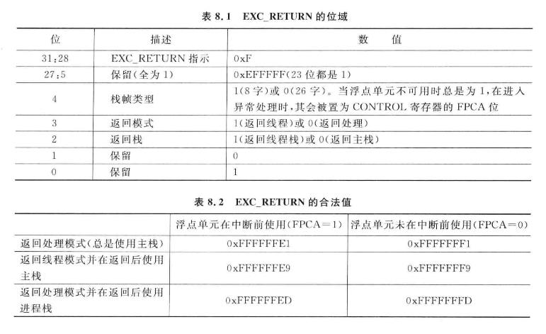

看到这张图，我想你应该会知道为什么我之前说正常情况下应该返回 `0xFFFFFFFD`，因为我没用 FPU, 且我在任务调度，所以下一刻应该换任务，这就要求必须切换到 PSP 和线程模式，所以对应就只能是这个值了。

有了这些前置知识，我想你应该可以自己分析这张图：

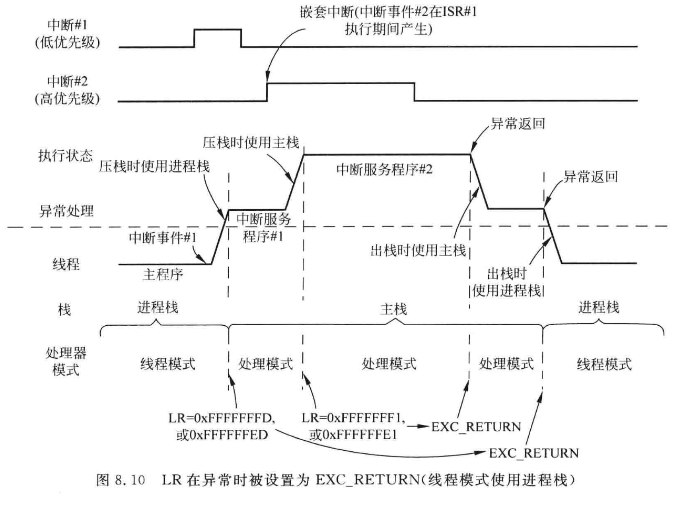

## OS、PendSV

### 什么是 OS，什么是 RTOS

这部分是我个人的拙见，如有错误还请多多海涵，不吝赐教。

OS，按照教科书上的定义，指的是管理计算机硬件与软件资源的程序。打个比方，就好比你去餐厅吃饭，跟服务员点菜，服务员负责把订单交给厨师，此外服务员同时负责维持餐厅的秩序，这里服务员就承担着类似于 OS 的角色，服务员既要和厨师（底层硬件）交流，又要负责安排客人入座，维持现场秩序（管理各种资源）。

而 RTOS 则相对而言更加简化一些，它依然需要管理各种资源，也依然需要和底层硬件沟通，但是 RTOS 则更加侧重于 RT (Real-Time)，就好比一个火爆的大餐厅，服务员不一定顾得上你，而一个苍蝇馆子，服务员则更能快速给你上菜。

广义上来说，一个 OS 可以分为三个组成部分：内核、 Shell，和一些杂七杂八的软件。但对于一个 OS 来说，**最核心的概念实际上是内核**，也就是**负责线程/进程/任务管理、内存管理、驱动管理等的程序**。这也是为什么 Linux 有那么多发行版，但它们仍然是 Linux； 各种 RTOS 虽然复杂程度不一（FreeRTOS 只有非常轻量的内核，RTT 和 Zephyr 可以有宛如 Linux 般的 dts 等复杂驱动适配），但它们都提供了任务创建、调度、信号量、各种锁，因为 OS 的核心与灵魂就是内核，而 RTOS 则是任务调度.

因此理解 RTOS 的内核在干些什么，就理解了 RTOS 在干什么。不过我们在这里不会讲调度算法，而是会更加侧重于 OS 的启动流程和上下文切换逻辑。我们将在下面介绍 Cortex-M 内核用于支持嵌入式 OS 的两个异常，并由此引出启动流程和上下文切换的逻辑。

### 什么是 PendSV

PendSV 中文名为可挂起的系统调用，其挂起状态可以在更高优先级的异常处理内设置，并且还会在高优先级处理完之后才执行，也就是说，只要将这玩意的优先级设置为最低，就可以让 PendSV 在其他中断任务搞定之后再执行，由于此特性，该异常对于上下文切换十分有用，这也是嵌入式 OS 设计的关键所在。

由于上下文切换属于任务调度，而任务调度属于 OS 内核，那么就得说下内核是个什么情况。

OS 内核的执行可由下面条件触发：
- 应用任务中 SVC 指令的执行（当应用在等一批数据或因为一些情况被耽搁，可以调用系统服务以向内核申请切换任务）
- 周期性的 SysTick 异常

一般来说， OS 会在 SysTick 触发时决定要换到什么任务去，但是如果此时发生了中断请求（IRQ），则 OS 不应当执行上下文切换，否则会导致 IRQ 处理延迟。

那么可以设想一下如果没有 PendSV 会是个什么情况：

没有 PendSV，那么就意味着发生 IRQ 时，你必须要优先处理 IRQ，且避免上下文切换，这看起来似乎很容易就解决了，然而当 IRQ 和 SysTick 发生频率相近呢？此时就会导致这两个中断“共振”——本来我在 SysTick 要换任务的，给你一搞结果啥都干不了。这会影响系统的性能。

然而，有了 PendSV 之后，我大可以在 PendSV 里面去处理，如果发生了 IRQ，那就先处理 IRQ，处理到最后再执行 PendSV， 这就保证了上下文虽然可能比较晚切换，但是一定能切换。

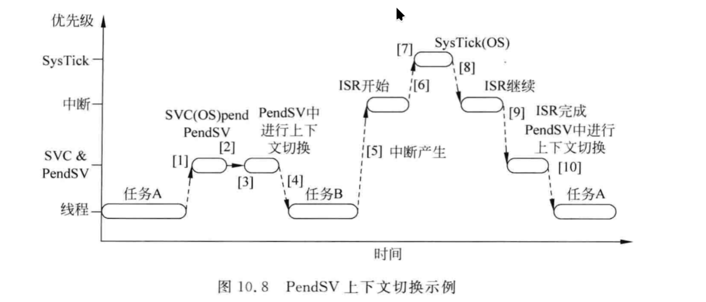

由于 PendSV 负责切换上下文，那么就必然涉及到任务的上下文保存和上下文加载，也就是说，对于准备切换的任务 A， PendSV 需要将它的寄存器值保存下来，而对于即将运行的任务 B，PendSV 需要恢复它的寄存器值，保存什么，恢复什么，都遵循 AAPCS 规范。

因此 PendSV 要做的事情简单点说就可以概括为四步：

1. 保存任务 A 的上下文（压栈）
2. 决定要切换成哪个任务（这里假定为任务 B）
3. 找到任务 B 的栈
4. 加载任务 B 的上下文（出栈）

然后把主动权还给任务 B 即可 (`bx r14`)。

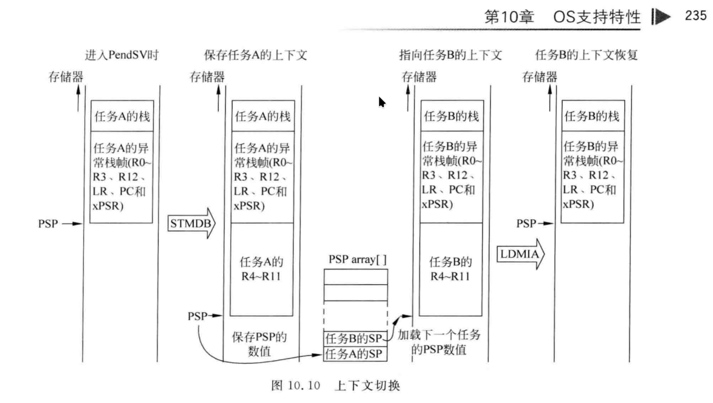

因此我们来看看 FreeRTOS 内的代码

### FreeRTOS 内的 PendSV 实现

让我们定位到 port.c 的这个函数：

```c
void xPortPendSVHandler( void )
```

其中：

```c
void xPortPendSVHandler( void ) __attribute__ (( naked ));
```

需要注意，宏定义里面加入了 `__attribute__((naked))`， 这说明该函数是裸函数，只能内联汇编。

由于 FreeRTOS 这部分的实现还涉及到一些不相关的内容（比如 `isb`, `dsb`），这些感兴趣的自行查阅，我们只抽出最重要的部分，此外让我们假设我们不使用 FPU （~~从而又能少讲几条指令，好耶！~~），首先让我们了解一个重要的东西——AAPCS 规范：

#### AAPCS 规范

AAPCS 规范，即 ARM 架构过程调用标准，它规定了编译器生成的汇编代码对 CPU 的操作约定（手写汇编最好也要遵守）。

该标准允许 C 函数修改 R0～R3，R12，R14（LR） 以及 PSR，如果要修改 R4～R11，则应当将这些寄存器保存到栈中，并在函数结束前将其恢复。

R0~R3, R12, LR, PSR 为“调用者保存寄存器”，若在函数调用后还需要使用这些寄存器的数值，就必须先行保存到内存中，而 R4~R11 为“被调用者保存寄存器”，被调用的子程序/函数需要保证这些值在函数结束时不会发生变化，不过在执行时可以发生变化，只是要确保函数返回时要恢复为初始值。

因此对于一个被调用的函数来说， R0~R3, R12, LR, PSR 的所有权不属于它，它无需管理这些东西，而 R4~R11 则属于它，它可以随便用这些东西，但用完之后要收拾好。

对于浮点单元也是类似的，这里不讲。

一般来说函数调用将 R0～R3 作为输入参数，R0 用作返回结果，若返回值为 64 位则 R1 也作为返回结果。

特别的，当处理异常时，返回地址（PC）的数值并不存在 LR, LR 存 `EXC_RETURN`，因此异常流程需要自行保存返回地址，也就是说此时异常处理需要保存八个寄存器（没有或者不启用 FPU 时），分别为 r4~r11, r14(lr)。

#### 保存任务 A 的上下文（压栈）

下面这部分代码就是保存任务 A 上下文的代码：

```asm
mrs r0, psp

ldr r3, pxCurrentTCBConst
ldr r2, [r3]

stmdb r0!, {r4-r11, r14}
str r0, [r2]
```

第一条指令将 psp 的值读取到 r0 中，而第二句和 `pxCurrentTCB` 这个变量有关(见 tasks.c 文件)：

```c
/*lint -save -e956 A manual analysis and inspection has been used to determine
which static variables must be declared volatile. */
PRIVILEGED_DATA TCB_t * volatile pxCurrentTCB = NULL;
```

第二句实际上表示将 `pxCurrentTCB` 赋值给 r3，而因为这个变量是个指针，因此就需要解引用，而这就是第三句干的事情了，此外十分注意， `ldr r2, [r3]` 实际上表示的是拿出 r3 寄存器对应内存中的第一个值，并赋值给 r2，那么第一个值是什么呢，让我们来看：

```c
/*
 * Task control block.  A task control block (TCB) is allocated for each task,
 * and stores task state information, including a pointer to the task's context
 * (the task's run time environment, including register values)
 */
typedef struct tskTaskControlBlock 			/* The old naming convention is used to prevent breaking kernel aware debuggers. */
{
	volatile StackType_t	*pxTopOfStack;	/*< Points to the location of the last item placed on the tasks stack.  THIS MUST BE THE FIRST MEMBER OF THE TCB STRUCT. */
	/* ...... */
} tskTCB;
```

现在知道为什么任务控制块 TCB 还要特地声明必须要把 `pxTopOfStack` 放在结构体的第一个变量了吧？

```c
	volatile StackType_t	*pxTopOfStack;	/*< Points to the location of the last item placed on the tasks stack.  THIS MUST BE THE FIRST MEMBER OF THE TCB STRUCT. */
```

本质上来说其实就是因为这两句以及其他类似的操作。

然后  `stmdb r0!, {r4-r11, r14}`, `str r0, [r2]` 就没什么好说的了，前一句就是把相关的寄存器存到任务 A 的堆栈去（AAPCS 规范，记住，下面不说了），第二句就是把新的栈指针存回去。

#### 切换任务上下文

下面这一段是切换任务上下文的代码：

```asm
stmdb sp!, {r0, r3}
/* ... */
bl vTaskSwitchContext
/* ... */
ldmia sp!, {r0, r3}
```

这一段实际上就是一个完整的汇编代码调用函数的标准流程: prologue(压栈，设值) => body(调用) => epilogue(出栈，复原)

因此我们只看 `bl vTaskSwitchContext`，这个函数位于 tasks.c

```c
void vTaskSwitchContext( void )
{
    /* ... */
    /* 如果你配置了我上篇文章说的宏的话，这里就会正常调用 */
		taskCHECK_FOR_STACK_OVERFLOW();
		/* ... */
		
		/* Select a new task to run using either the generic C or port
		optimised asm code. */
		taskSELECT_HIGHEST_PRIORITY_TASK(); /*lint !e9079 void * is used as this macro is used with timers and co-routines too.  Alignment is known to be fine as the type of the pointer stored and retrieved is the same. */
		/* ... */
}
```

我们只需要看 `taskSELECT_HIGHEST_PRIORITY_TASK()`，这个宏函数的实现，其中一句是：

```c
		listGET_OWNER_OF_NEXT_ENTRY( pxCurrentTCB, &( pxReadyTasksLists[ uxTopPriority ] ) );		\
```

对应：

```c
#define listGET_OWNER_OF_NEXT_ENTRY( pxTCB, pxList )										\
{																							\
List_t * const pxConstList = ( pxList );													\
	/* Increment the index to the next item and return the item, ensuring */				\
	/* we don't return the marker used at the end of the list.  */							\
	( pxConstList )->pxIndex = ( pxConstList )->pxIndex->pxNext;							\
	if( ( void * ) ( pxConstList )->pxIndex == ( void * ) &( ( pxConstList )->xListEnd ) )	\
	{																						\
		( pxConstList )->pxIndex = ( pxConstList )->pxIndex->pxNext;						\
	}																						\
	( pxTCB ) = ( pxConstList )->pxIndex->pvOwner;											\
}
```

因此 `pxCurrentTCB` 会通过 `vTaskSwitchContext` 自动更新，回到 PendSV 之后，这里就是一个等待执行的任务了。

#### 找到任务 B 的栈

下面这一段负责找到任务 B 的栈

```asm
ldr r1, [r3]
ldr r0, [r1]
```

没什么好说的，记住 `r3 = pxCurrentTCB` 即可，所以 r0 是任务 B 的栈顶指针。

#### 加载任务 B 的上下文（出栈）

这个相对简单些：

`ldmia sp!, {r4-r11, r14}`

本质上来说就是

`pop {r4-r11, r14}`

然后再设置一下 `psp` 为任务 B 的栈指针(`msr psp, r0`)，执行 `bx r14` 以从异常中返回，并把控制权交还给任务 B 即可。

## 本次 HardFault 的因果链

有了这些前置的理论知识，我们可以来 debug 了。

由于之前提到的错误是 UNALIGNED, 所以我们只要锚定与内存访问有关的函数和指令即可

由于我们已经有了调用堆栈，所以我们可以知道栈溢出错误是在切换上下文的时候产生的，那么自然就是找 PendSV 处理函数的问题，由于我在调试的时候已经定位到是 `ldmia r0!, {r4-r11, r14}` 的问题了，那么就让我们打断点到改变了 r0 寄存器值的指令吧！

因此断点设置在 `ldr r0, [r1]`，这一步意味着从 `pxCurrentTCB` 中拿到 `pxTopOfStack` 的值。

注意观察左侧 Register 栏的 r0 和 r1：

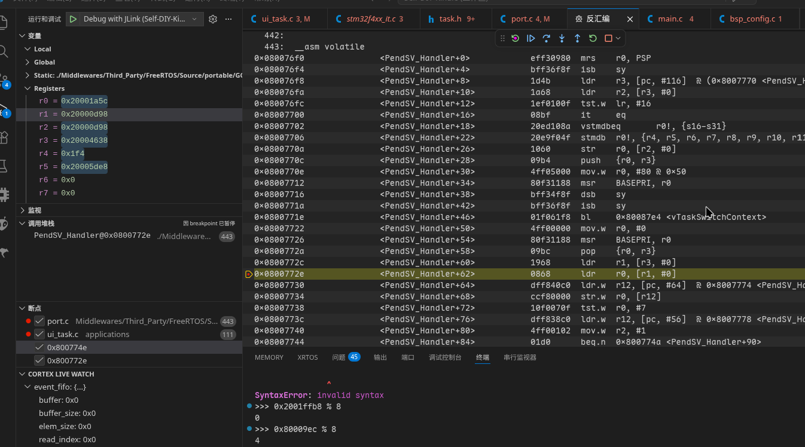

目前是很正常的。

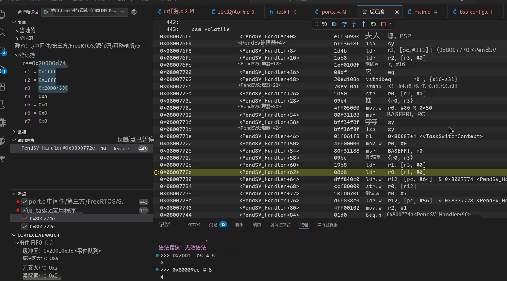

但是到了这里：

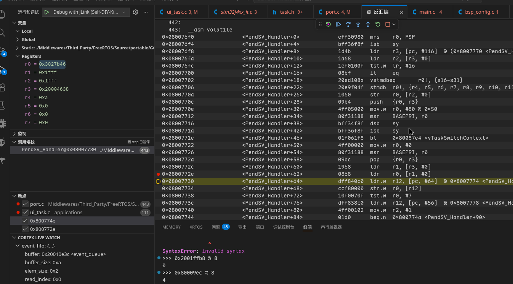

看, r3 是正常的，但是 r2 和 r1 变成了 0x1fff, 这说明在程序运行过程中，有指令将 `pxCurrentTCB` 对应的值修改为 0x1fff，进而导致 r0 从 r1 读出了垃圾值 0x3027b46，由于这个值不是 4 字节对齐的，最后使用 `ldmia` 对 UITask 的栈进行访问的时候就理所当然地炸掉了。

那么假如说，我们想找到是谁修改的呢？也很简单，借助 GDB 即可，为了确认是谁修改了这玩意对应的值，我们需要先找到它在内存中对应的地址，那么：

```shell
(gdb) p &pxCurrentTCB
$1 = (TCB_t * volatile *) 0x20004630 <pxCurrentTCB>
```

然后我们将断点打在 `StartUITask` 的 `os_delay_ms(500)`，等运行到那里之后，再输入：

```shell
(gdb) watch *(uint32_t *)0x20004630 if *(uint32_t *)0x20004630 == 0x1fff
Hardware watchpoint 1: *(uint32_t *)0x20004630
```

然后继续运行，接下来我们可以看到：

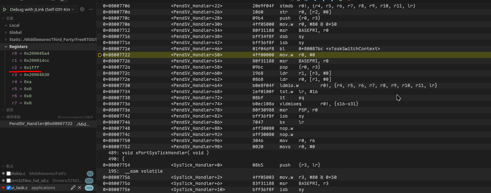

注意我这里为什么标了 r2, 是因为一开始保存任务 A 的上下文的时候有一句 `ldr r2, [r3]`，说明 r2 实际上就是 `*pxCurrentTCB`，所以很明显值是在 `bl vTaskSwitchContext` 中被修改的， GDB 执行完这一句之后发现值被修改，于是停了下来，正好落在把 r0 清零的汇编上。

或者更具体些（复现方法是在 `bl vTaskSwitchContext` 中打断点，运行到之前的 `os_delay_ms(500)` 之后，第一次 `bl` 是正常的，我们继续运行，第二次 `bl` 就需要进去这个函数里面看是哪里被修改了）：

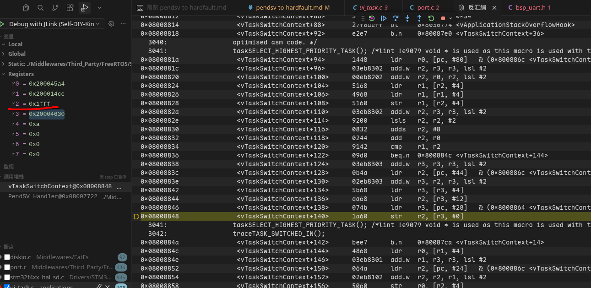

这三句是“帮凶”：

```asm
/* 将原本 r3[4] 的值重新给 r3 */
ldr r3, [r3, #4]
/* 将 r3[12] 的值（被篡改成 0x1fff）取出并放到 r2 */
ldr r2, [r3, #12]
/* 将 pxCurrentTCB 存到 r3 */
ldr r3, [pc, #28]
/* 将当前 r2 的值更新到 r3[0] (pxTopOfStack) */
str r2, [r3, #0]
```

执行完这三句之后我们可以看到确实是被修改了的：

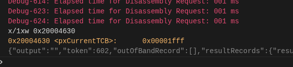

进而导致下面的 `ldmia` 因为垃圾值内存没对齐而炸掉。

然后我们再来找一下真凶，由于值在 `r3[12]`， 而 r3 此时为 `0x200014cc`（执行 `ldr r3, [r3, #4]` 那一句时），于是我们重新开始调试，并在 GDB 中输入：

```shell
(gdb) watch *(uint32_t *)(0x200014cc+0x0c) if *(uint32_t *)(0x200014cc+0x0c) == 0x1fff
```

然后你会发现 LVGL 库里的这一句被反复暂停：

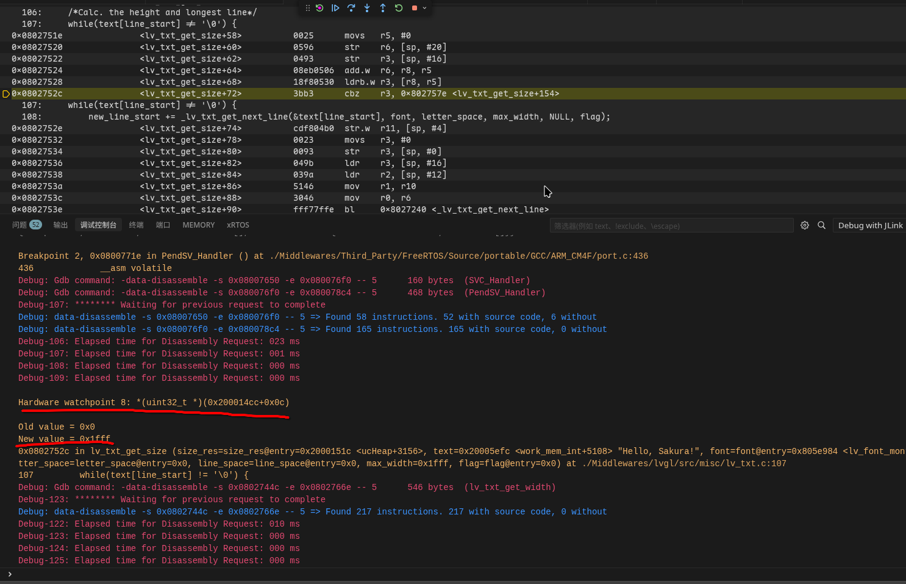

接下来执行 `os_delay_ms(500)`，然后两次 `bl vTaskSwitchContext` 之后“帮凶”成功把“鬼子领进村了”。

（第一次 `bl vTaskSwitchContext` 并进去之后，看上面提到的四句，r3 的值为 0x20000d94, 而第二次 `bl` 则为 0x200014cc）。

我们再来看一开始写的 Hook 函数，现在我们做如下修改：

```c
#include "FreeRTOS.h"
#include "task.h"
/* 临时暴露 TCB 结构体定义以访问栈指针 */
struct tskTaskControlBlock {
    volatile StackType_t *pxTopOfStack;
    ListItem_t xStateListItem;
    ListItem_t xEventListItem;
    UBaseType_t uxPriority;
    StackType_t *pxStack;
};

void vApplicationStackOverflowHook(TaskHandle_t xTask,
                                   char *pcTaskName)
{
    printf("Stack overflow in task %s\r\n"
           "=> [pxTopOfStack: %p]\r\n"
           "=> [pxStack: %p]\r\n"
           "=======================\r\n",
           pcTaskName, xTask->pxTopOfStack, xTask->pxStack);

    if (strcmp(pcTaskName, "UITask") == 0) {
        gpio_write(&usr_led, GPIO_Level_High);
    }
}
```

打印信息为：

```
Stack overflow in task UITask
=> [pxTopOfStack: 0x200013fc]
=> [pxStack: 0x20001528]
=======================
```

`pxStack` 表示栈起始地址，具体的自己看 `TCB` 结构体了。那么我用计算机算出来 0x1528 - 0x13fc = 300（单位 `StackType_t`, 即 Word）, 而 CubeMX 分配的是 512 Words，然后之前说到的 0x200014cc, 我想就是因为栈溢出之后栈指针回环，然后导致读取到了垃圾值而导致的最终 UNALIGNED 错误。

TODO: 需要实现栈的峰值检测，用来确定确实有超过 512 的情况。

事实上 `pxStack - pxTopOfStack` 的值一般比 512 略小，但函数运行时只要调用链一深，那么栈很容易就会炸掉，很不幸的是，LVGL 正好是那种调用链异常深的第三方库。

## 总结

这次其实确确实实暴露了我对 FreeRTOS 了解不深的严重问题，也正好和我的初心相符了，算是一种求锤得锤吧（笑）。**如果遇到了什么玄学问题，首先看下堆栈啥的正不正常，这也许是各种 RTOS 在调试时先要确认的一步吧**！此外还因为这个 BUG 而被迫看了 FreeRTOS 的代码，说实话写得还真的非常漂亮，仿佛在欣赏一件艺术品，已严肃偷师（笑）。

---

[STM32 Cortex M4 编程手册]: https://www.st.com/content/ccc/resource/technical/document/programming_manual/6c/3a/cb/e7/e4/ea/44/9b/DM00046982.pdf/files/DM00046982.pdf/jcr:content/translations/en.DM00046982.pdf
[ARM CM3/4 异常进入与返回的过程]: https://shequ.stmicroelectronics.cn/thread-604515-1-1.html
[RTOS 基础知识]: https://wwww.freertos.org/zh-cn-cmn-s/Documentation/01-FreeRTOS-quick-start/01-Beginners-guide/01-RTOS-fundamentals
[深入理解操作系统的概念及定位]: https://www.cnblogs.com/kevinbee/p/18678187
[FreeRTOS 堆栈使用和堆栈溢出检查]: https://w.freertos.org/zh-cn-cmn-s/Documentation/02-Kernel/02-Kernel-features/09-Memory-management/02-Stack-usage-and-stack-overflow-checking
[RTOS Ref]: https://www.zhihu.com/question/593816921/answer/1957909257069520682?share_code=14IBMqKlAx7yM&utm_psn=2050173737027236484
