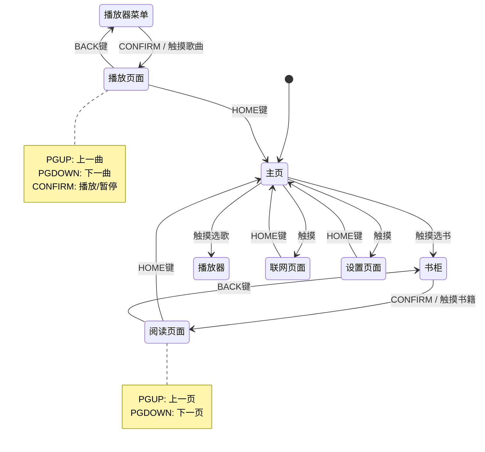

整体设计上来说主要是电子书、mp3 两个主要界面，以及控制协处理器（ESP8266）的页面

因此对于界面来说（我们不讲究细致的），则必然会有：

主页、阅读页面、播放器页面

细分则可以分为：

主页 -> 阅读器（书柜选书） -> 阅读器（阅读页面）
主页 -> 播放器（选歌） -> 播放器（播放页面）
主页 -> 联网页面（此处可以选择联网交互模式，比如传书，更新固件等，平时就算不切换到这个页面也会和协处理器定时获取数据）
主页 -> 设置页面

我们目前屏幕有触控，还定义了五个按键：HOME、BACK、PGDOWN、PGUP、CONFIRM

实际上我想也许不需要 5 个，可能四个足够了？如果借助开源库(easy-button)的话甚至能够实现长按和组合键逻辑

| 按键    | 短按 (≤0.5s)                 | 长按 (≥1s)                         |
| ------- | ---------------------------- | ---------------------------------- |
| HOME    | 返回主页（全局，最高优先级） | 可选：呼出快捷菜单（如亮度、音量） |
| PGUP    | 上一页 / 上一曲 / 列表上移   | 快退 / 列表快速滚动到顶部          |
| PGDOWN  | 下一页 / 下一曲 / 列表下移   | 快进 / 列表快速滚动到底部          |
| CONFIRM | 确认 / 播放 / 暂停           | 弹出上下文菜单（如“加入收藏”）     |

触摸不是很有必要说明如何交互，不过既然使用了 LVGL，我想应当引入输入法进行搜索操作。

